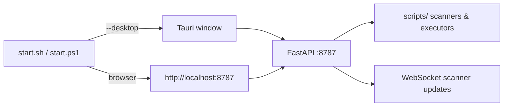
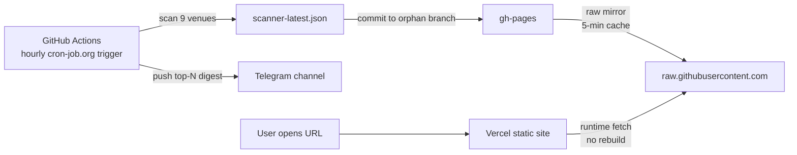

# Funding Rate Arbitrage Engine

Cross-exchange **funding rate** arbitrage: Cash-and-Carry, unified cross-venue carry, and **Pure Futures** (perp–perp) spreads — with a **Vue dashboard**, CLI, and optional **Tauri** desktop shell.

**🌐 Live Demo:** <https://funding-arb.llm.christmas> — hourly-updated scanner snapshot, no signup.

**📡 Telegram Channel:** [@FundingArbDigest](https://t.me/FundingArbDigest) — top funding spreads pushed every hour.

**CEX (spot + USDT-M perps):** Binance · Bitget · Bybit · OKX  
**Perp DEX (scan; trade where supported):** Hyperliquid · dYdX v4 · Aster · Lighter · EdgeX

Default scanner venues are **CEX-only**; DEX venues are opt-in via the UI or `--venues`. Browser wallet signing (MetaMask / Keplr) is available for Hyperliquid and dYdX — see [Wallet Trading](#browser-wallet-trading).

> ⚠️ **Disclaimer:** This is trading software that can place **real orders and lose money**. Educational/research use only; not financial advice; use at your own risk. See [Disclaimer](#disclaimer).

---

## Strategies

| Strategy | CLI / runner | Dashboard tab | Description |
|----------|--------------|---------------|-------------|
| **Pure Futures Spread** ⭐ | `scan_pure_futures_spreads.py`, `run_pure_futures_spread.py` | Scanner → Pure Futures | Long perp on one venue, short on another; capture funding **rate differential**. No spot or borrow. |
| **Cash & Carry** | `scan_funding_arbitrage.py`, `run_cash_and_carry.py` | Scanner → Cash & Carry | Spot long + perp short (or reverse via borrow) on CEX. |
| **Unified C&C** | `scan_unified_funding.py` | Scanner → Unified C&C | Spot leg and futures leg on **different** venues for best combined edge. |
| **Cross-asset C&C** | `run_cash_and_carry.py` (`crossAssetArbitrage`) | — | Multi-asset slot contention; hold top spreads only. |

### Pure Futures metrics (scanner)

| Field | Meaning |
|-------|---------|
| `net_edge_pct` | Funding spread minus **open-leg taker fees** (both sides) |
| `mark_spread_pct` | Mark-price gap between venues (entry slippage risk) |
| `real_edge_pct` | `net_edge_pct − mark_spread_pct` (conservative edge) |
| `settle_mismatch` | Different funding intervals (e.g. HL 1h vs CEX 8h) |
| `history.stable_pct` | Share of the trailing 7d hourly snapshots where the pair's spread cleared the entry threshold — sustained vs one-scan spikes |
| `history.spread_z` | (current spread − trailing mean) / trailing std — how stretched the entry is vs its own history |

Cross-interval pairs use a **basis-blend model** (mark vs index, weighted by settlement progress). See [`docs/en/cross-interval.md`](docs/en/cross-interval.md).

**Funding history:** every scan records the full rate matrix to `<FARB_HOME>/funding_history.jsonl` (throttled to ~1 snapshot/hour; disable with `FARB_FUNDING_HISTORY=0` or `--no-history`). After ~12h of history, scanner rows and the dashboard get a **Stability** column ranking pairs by sustained differentials.

---

## Quick Start

```bash
git clone https://github.com/counterfactual5/funding-arb.git
cd funding-arb
bash setup.sh
```

### Visual dashboard (recommended)

```bash
# Browser mode (macOS / Linux / Windows)
bash start.sh              # build web + start API → http://localhost:8787

# Desktop (requires Rust)
bash start.sh --desktop

# Windows
.\start.ps1
.\start.ps1 -Desktop
```



**Dashboard pages:** Scanner · Positions · Backtest · Docs · CEX · DEX · Strategy · Fees · Advanced

**Scanner highlights:**
- Three strategy tabs with background warm-up for pure / carry / unified
- Venue filter (CEX / DEX groups); scans **only selected venues**
- Min net edge, same-interval / cross-interval filters
- Fee-aware edge (`net_edge` / `real_edge` tooltips)
- Open position dialog with **backend (auto)** or **wallet (manual)** execution mode

**Positions highlights:**
- 6 summary cards: open count, total PnL (incl. funding estimate), total fees, win rate, avg hold, total trade
- Expandable rows with full breakdown: open/close prices, entry/exit spread, gross/net PnL, funding income estimate
- Cumulative PnL equity curve (echarts)

### Browser Wallet Trading

The DEX connection page supports **browser wallet extension** signing for test orders and Scanner one-click open:

| Venue | Wallet | Signing Mode |
|-------|--------|-------------|
| **Hyperliquid** | MetaMask | Agent wallet (one-time approve, then session key signs) |
| **dYdX v4** | Keplr | Per-tx Amino signing |
| Lighter / EdgeX / Aster | MetaMask | Address read only; trading needs API keys |

Two parallel execution paths coexist:
- **Backend (auto):** server signs with configured API keys — for 7×24 automated arbitrage
- **Wallet (manual):** browser signs via extension — for testing and manual orders without uploading private keys

### CLI scanning

```bash
# Pure futures — default CEX; add DEX explicitly
.venv/bin/python scripts/cli/scan_pure_futures_spreads.py --verbose
.venv/bin/python scripts/cli/scan_pure_futures_spreads.py \
  --venues binance,bitget,bybit,okx,hyperliquid --json

# Continuous watch → data/pure_futures_spreads.jsonl (for backtest)
.venv/bin/python scripts/cli/scan_pure_futures_spreads.py --watch 5

# Cash-and-carry (CEX)
.venv/bin/python scripts/cli/scan_funding_arbitrage.py --venues bitget,bybit,okx,binance

# Unified cross-venue carry
.venv/bin/python scripts/cli/scan_unified_funding.py --verbose
```

### Paper / live execution

```bash
# Cash-and-Carry (dry-run default in config)
.venv/bin/python scripts/execution/run_cash_and_carry.py \
  --config templates/config.cash_and_carry.btc.json --verbose

# Pure futures — single shot or watch loop
.venv/bin/python scripts/execution/run_pure_futures_spread.py \
  --config templates/config.pure_futures.spread.json --once --verbose

.venv/bin/python scripts/execution/run_pure_futures_spread.py \
  --config templates/config.pure_futures.spread.json --watch 5 --verbose

# Position watcher
.venv/bin/python scripts/execution/pure_futures_watcher.py \
  --config templates/config.pure_futures.spread.json --interval 30 --verbose

# Orchestrator
.venv/bin/python scripts/cli/orchestrate_funding.py --pure-futures --run-executor --verbose
```

### Manual pure-futures trades

```bash
.venv/bin/python scripts/cli/pure_futures_trade.py open BTC \
  --long-venue okx --short-venue bybit --trade-usd 500 --dry-run
.venv/bin/python scripts/cli/pure_futures_trade.py list
.venv/bin/python scripts/cli/pure_futures_trade.py close <position_id> --dry-run
```

### Telegram digest bot (cron-friendly)

A thin scan-and-push wrapper that runs once, formats the top-N pure-futures
spreads into a compact HTML digest, posts it to a Telegram chat/channel (with
optional inline URL buttons to the demo dashboard), and exits. No
long-running state, no order execution — perfect for GitHub Actions cron,
systemd timers, or any serverless scheduler.

```bash
# 1. Configure secrets (any of: .env, shell export, GitHub Actions secrets)
export TELEGRAM_BOT_TOKEN="123456:ABC-..."        # from @BotFather
export TELEGRAM_CHAT_ID="@your_channel"          # or numeric -100...

# 2. Smoke-test locally without posting
.venv/bin/python scripts/notify/telegram_push.py --dry-run --top 5

# 3. Real push
.venv/bin/python scripts/notify/telegram_push.py --top 10 --min-edge 0.03

# 4. Include perp DEX venues (HL / Aster / Lighter / EdgeX / dYdX)
.venv/bin/python scripts/notify/telegram_push.py --include-dex

# 5. Override demo URL for inline buttons (or "" to disable)
.venv/bin/python scripts/notify/telegram_push.py --dashboard-url https://your-demo.vercel.app
```

**GitHub Actions** — see [`.github/workflows/telegram-push.yml`](.github/workflows/telegram-push.yml)
and [`docs/zh-CN/serverless-pipeline.md`](docs/zh-CN/serverless-pipeline.md). Hourly cadence
is driven by an external **cron-job.org** task that POSTs to `workflow_dispatch`
(with `"source": "cron"` for anti-spam). Add `TELEGRAM_BOT_TOKEN` and
`TELEGRAM_CHAT_ID` under `Settings → Secrets and variables → Actions`, then
trigger via `Actions → TG Funding Push → Run workflow`.

> 💡 GitHub-hosted runners are outside China, so they reach `api.telegram.org`
> without a proxy. If you self-host the cron from a mainland CN network,
> route through a HK / SG box or configure an HTTPS proxy.

Tests: `scripts/tests/test_telegram_push.py` (48 cases — compact formatting,
inline keyboard, chunking, HTML escaping, venue resolution; no network).

### Live Demo (Vercel + GitHub Actions data pipeline)

A read-only public demo of the dashboard runs on Vercel, refreshed hourly by
the same GitHub Actions cron that drives the Telegram bot. Zero ongoing cost,
zero servers, **zero Vercel rebuilds** — fresh data lands via a runtime fetch
from `raw.githubusercontent.com`.



**One-time setup:**

1. Push to `main` — the workflow (`telegram-push.yml`) creates the `gh-pages`
   orphan branch automatically on first run.
2. Import the repo on Vercel → set framework to **Vite** → set root directory
   to `web`. Demo mode auto-activates on any `*.vercel.app` deployment, so
   `VITE_DEMO_MODE=1` is optional (but recommended for clarity).
3. Deploy. Open the URL — you'll see the `🎭 Demo Mode` banner with the last
   scan timestamp, auto-refreshed every 5 minutes.

**Local demo smoke-test:**

```bash
# Generate a snapshot from real exchange data
.venv/bin/python scripts/notify/snapshot_to_pages.py --out /tmp/s.json --top 30

# Run the dev server in demo mode
cd web && VITE_DEMO_MODE=1 npm run dev

# Or force demo mode on any deployment via query string
open 'http://localhost:1420/?demo=1'
```

See [`docs/zh-CN/serverless-pipeline.md`](docs/zh-CN/serverless-pipeline.md)
(or [en](docs/en/serverless-pipeline.md) / [zh-TW](docs/zh-TW/serverless-pipeline.md))
for the full architecture write-up.

### Reports & backtesting

```bash
.venv/bin/python scripts/cli/report_pure_futures_spreads.py \
  --jsonl-file data/pure_futures_spreads.jsonl --since-hours 24 --min-samples 3

.venv/bin/python scripts/backtest/backtest_pure_futures_spread.py \
  --jsonl-file data/pure_futures_spreads.jsonl --capital 100000 --json
```

Historical funding backfill (no JSONL required): `scripts/backtest/funding_history_source.py` — used by the dashboard Backtest page.

---

## Fee policy & VIP tiers

Net edge in the scanner deducts **per-leg taker fees**. Fee resolution (`scripts/core/fee_providers.py`):

| Mode | Behavior |
|------|----------|
| `auto` | Live fee API when keys are configured; else VIP tier table |
| `tier` | Static VIP ladder (`scripts/core/vip_fee_tiers.py`) |
| `manual` | Overrides in strategy config |

Configure in **Settings → Strategy**: `fee_mode`, `venue_fee_tiers`, scan thresholds (`min_edge_annual`, `min_edge_1h`, `min_edge_mismatch`).

**API:**
- `GET /api/settings/fees` — resolved rates per venue
- `GET /api/settings/fee-tiers` — available tier labels
- `POST /api/scanner/recalc-fees` — recompute cached scan results without re-scanning

---

## HTTP API (summary)

| Endpoint | Purpose |
|----------|---------|
| `GET /api/scanner/opportunities?strategy=&venues=` | Cached scan results (venue-aware cache) |
| `POST /api/scanner/trigger?strategy=&venues=` | On-demand scan |
| `GET /api/scanner/status` | Scanning flag, last scan time |
| `GET/POST /api/settings/strategy` | Thresholds, venues, fee policy |
| `GET /api/settings/venues` | Scan/trade/live capability per venue |
| `GET /api/settings/wallet/schema` | Per-venue credential field schemas (CEX + DEX) |
| `GET /api/settings/wallet/status` | Connection status, masked credentials, balance |
| `POST /api/settings/wallet/connect` | Set credentials as env vars |
| `POST /api/settings/wallet/disconnect` | Clear credentials |
| `GET /api/settings/trading-mode` | Overall + per-venue mode (dry_run/live) |
| `POST /api/positions/open` | Open hedge (dry-run default) |
| `POST /api/backtest/run` | Run backtest from history or JSONL |
| `WS /ws/events` | `scanner.update` push events |

### Optional API authentication

Set `FARB_API_TOKEN` in the environment (or `.env`) to require a token on every `/api/*` route and the `/ws/events` WebSocket:

- **HTTP:** `Authorization: Bearer <token>`, `X-Api-Token: <token>`, or `?token=<token>`
- **WebSocket:** `?token=<token>` (browsers cannot set WS headers)
- **Dashboard:** Settings → Advanced → *API access token* (stored per-browser, sent automatically)

Unset/empty → auth disabled (identical to previous behaviour). Static assets and `/docs` stay public; token comparison is timing-safe. Recommended whenever the server is reachable beyond `localhost`.

---

## Configuration

1. Copy `.env.example` → `.env`
2. **Paper:** no keys required (`dry_run: true` in templates / UI)
3. **Live:** exchange API keys with **spot + USDT-M futures** trade permission; **no withdrawal**

| Exchange | Environment variables |
|----------|----------------------|
| Bitget | `BITGET_API_KEY`, `BITGET_SECRET_KEY`, `BITGET_PASSPHRASE` |
| Binance | `BINANCE_API_KEY`, `BINANCE_API_SECRET` |
| OKX | `OKX_API_KEY`, `OKX_SECRET_KEY`, `OKX_PASSPHRASE` |
| Bybit | `BYBIT_API_KEY`, `BYBIT_SECRET_KEY` |
| Hyperliquid | Sibling `../hyperliquid` repo + wallet keys (live) |
| Aster | `ASTER_API_KEY`, `ASTER_API_SECRET` |
| Lighter | `LIGHTER_API_PRIVATE_KEY`, account/index env (see `.env.example`) |
| EdgeX | `EDGEX_ACCOUNT_ID`, `EDGEX_TRADING_PRIVATE_KEY` (live trade) |

### Credential management

```bash
.venv/bin/python scripts/cli/setup_credentials.py              # Interactive wizard
.venv/bin/python scripts/cli/setup_credentials.py --check
```

Backends (auto-selected, most secure first): **keyring** → **systemd-creds** → **age** → plaintext `~/.funding-arb/credentials.json`. Loaded into the environment at server start via `ensure_env()`.

| Variable | Description |
|----------|-------------|
| `FARB_HOME` | Runtime data root (state, journal, backtest output); legacy `DCA_HOME` still works |
| `FARB_RUNS_NAMESPACE` | Subdirectory name (default `funding-arb`); legacy `DCA_RUNS_NAMESPACE` |
| `FARB_DRY_RUN=1` / `FARB_LIVE=1` | Force paper / live (legacy `DCA_DRY_RUN` / `DCA_LIVE`) |

Strategy JSON: `scripts/data/strategy_config.json` (also editable in Settings UI).

---

## Directory structure

```
funding-arb/
├── docs/
│   ├── README.md                         # Doc index (zh-CN / en / zh-TW)
│   └── zh-CN/ en/ zh-TW/                 # Strategy & algorithm docs (from web UI)
├── plans/
│   └── edgex-integration-plan.md
├── templates/                 # Strategy config templates
├── scripts/
│   ├── cli/                   # scan_*, orchestrate, pure_futures_trade, setup_credentials
│   ├── execution/             # runners, executors, settle_mismatch_planner, watcher
│   ├── strategies/futures/    # decision engines
│   ├── backtest/              # backtest, funding_providers, funding_history_source
│   ├── core/                  # credentials, fee_providers, vip_fee_tiers,
│   │                          # cross_interval_funding
│   ├── venues/                # CEX + hyperliquid, aster, lighter, edgex
│   ├── market/                # parallel_fetch, futures_depth, price_oracle
│   └── tests/                 # pytest suite
├── server/
│   ├── main.py                # FastAPI + static UI + background scanner loop
│   └── routes/                # scanner, positions, backtest, settings
├── web/                       # Vue 3 + Naive UI (+ src-tauri optional)
├── SKILL.md                   # AI agent CLI playbook
├── start.sh / start.ps1
└── setup.sh
```

---

## Testing

```bash
pip install -r requirements.txt   # or: bash setup.sh
.venv/bin/python -m pytest scripts/tests/ -q
# 370+ tests — scanners, fees, venues (incl. HL/Aster/Lighter/EdgeX), executor, backtest, notify
```

---

## Documentation

| Doc | Contents |
|-----|----------|
| [`docs/README.md`](docs/README.md) | **Algorithm docs index** — zh-CN / en / zh-TW (funding basics, C&C, Pure Futures, fees, cross-interval) |
| [`SKILL.md`](SKILL.md) | CLI-first workflow for AI agents (`@SKILL.md` in Cursor) |
| [GitHub Issues](https://github.com/counterfactual5/funding-arb/issues) | Roadmap — planned features, venue expansion, known gaps |
| [`plans/edgex-integration-plan.md`](plans/edgex-integration-plan.md) | EdgeX scan + trade integration notes |

In-app **Docs** page mirrors `docs/{locale}/`. After editing `web/src/content/docs/articles/*.ts`, regenerate Markdown:

```bash
.venv/bin/python scripts/tools/gen_zh_tw_docs.py   # zh-TW sections
npx tsx scripts/tools/export_docs_md.mts           # docs/zh-CN, en, zh-TW
```

---

## Disclaimer

This software is for **educational and research purposes**. When configured for
live trading it places **real orders against live exchange accounts and can lose
money**. Nothing here is financial advice. You are solely responsible for your
API keys, private keys, funds, and any executed trades.

- Start with `dry_run` / testnet and verify behaviour before going live.
- Use exchange API keys with **trade-only** permission — **no withdrawal**.
- Review the code before trusting it with real capital.

The software is provided **"AS IS", without warranty of any kind**, and the
authors accept **no liability** for any losses — see [`LICENSE`](LICENSE).

## License

[MIT](LICENSE) © 2026 counterfactual5
